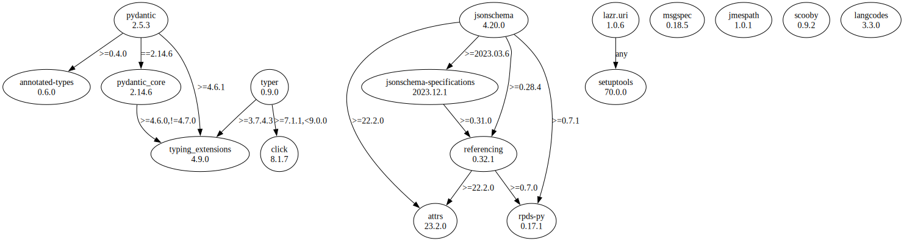

# Third Party Dependencies

<!--[[[fill sbom_sha256()]]]-->
The [SBOM in CycloneDX v1.4 JSON format](https://git.sr.ht/~sthagen/csaf/blob/default/etc/sbom/cdx.json) with SHA256 checksum ([eccc3529 ...](https://git.sr.ht/~sthagen/csaf/blob/default/etc/sbom/cdx.json.sha256 "sha256:eccc3529ce78476fe2fd52b52abf1f682e93bf6ea835abab811c568edbe94f20")).
<!--[[[end]]] (checksum: a5b2a8294cfaee2fd51ef7c391e79e0b)-->
## Licenses

JSON files with complete license info of: [direct dependencies](direct-dependency-licenses.json) | [all dependencies](all-dependency-licenses.json)

### Direct Dependencies

<!--[[[fill direct_dependencies_table()]]]-->
| Name                                                            | Version                                                | License                                             | Author                                                                                                                                                                                                                                                        | Description (from packaging data)                                                                        |
|:----------------------------------------------------------------|:-------------------------------------------------------|:----------------------------------------------------|:--------------------------------------------------------------------------------------------------------------------------------------------------------------------------------------------------------------------------------------------------------------|:---------------------------------------------------------------------------------------------------------|
| [jmespath](https://github.com/jmespath/jmespath.py)             | [1.0.1](https://pypi.org/project/jmespath/1.0.1/)      | MIT License                                         | James Saryerwinnie                                                                                                                                                                                                                                            | JSON Matching Expressions                                                                                |
| [jsonschema](https://github.com/python-jsonschema/jsonschema)   | [4.19.0](https://pypi.org/project/jsonschema/4.19.0/)  | MIT License                                         | Julian Berman                                                                                                                                                                                                                                                 | An implementation of JSON Schema validation for Python                                                   |
| [langcodes](https://github.com/rspeer/langcodes)                | [3.3.0](https://pypi.org/project/langcodes/3.3.0/)     | MIT License                                         | Elia Robyn Speer                                                                                                                                                                                                                                              | Tools for labeling human languages with IETF language tags                                               |
| [lazr.uri](https://launchpad.net/lazr.uri)                      | [1.0.6](https://pypi.org/project/lazr.uri/1.0.6/)      | GNU Library or Lesser General Public License (LGPL) | "LAZR Developers" team                                                                                                                                                                                                                                        | A self-contained, easily reusable library for parsing, manipulating,                                     |
| [msgspec](https://jcristharif.com/msgspec/)                     | [0.18.2](https://pypi.org/project/msgspec/0.18.2/)     | BSD License                                         | Jim Crist-Harif                                                                                                                                                                                                                                               | A fast serialization and validation library, with builtin support for JSON, MessagePack, YAML, and TOML. |
| [pydantic](https://github.com/pydantic/pydantic)                | [2.3.0](https://pypi.org/project/pydantic/2.3.0/)      | MIT License                                         | Samuel Colvin <s@muelcolvin.com>, Eric Jolibois <em.jolibois@gmail.com>, Hasan Ramezani <hasan.r67@gmail.com>, Adrian Garcia Badaracco <1755071+adriangb@users.noreply.github.com>, Terrence Dorsey <terry@pydantic.dev>, David Montague <david@pydantic.dev> | Data validation using Python type hints                                                                  |
| [referencing](https://github.com/python-jsonschema/referencing) | [0.30.2](https://pypi.org/project/referencing/0.30.2/) | MIT License                                         | Julian Berman                                                                                                                                                                                                                                                 | JSON Referencing + Python                                                                                |
| [scooby](https://github.com/banesullivan/scooby)                | [0.7.2](https://pypi.org/project/scooby/0.7.2/)        | MIT License                                         | Dieter Werthmüller, Bane Sullivan, Alex Kaszynski, and contributors                                                                                                                                                                                           | A Great Dane turned Python environment detective                                                         |
| [setuptools](https://github.com/pypa/setuptools)                | [68.2.2](https://pypi.org/project/setuptools/68.2.2/)  | MIT License                                         | Python Packaging Authority                                                                                                                                                                                                                                    | Easily download, build, install, upgrade, and uninstall Python packages                                  |
| [typer](https://github.com/tiangolo/typer)                      | [0.9.0](https://pypi.org/project/typer/0.9.0/)         | MIT License                                         | Sebastián Ramírez                                                                                                                                                                                                                                             | Typer, build great CLIs. Easy to code. Based on Python type hints.                                       |
<!--[[[end]]] (checksum: 07dafe32fe50abbb1dd5014a7704c198)-->

### Indirect Dependencies

<!--[[[fill indirect_dependencies_table()]]]-->
| Name                                                             | Version                                                    | License                            | Author                                                                                | Description (from packaging data)                      |
|:-----------------------------------------------------------------|:-----------------------------------------------------------|:-----------------------------------|:--------------------------------------------------------------------------------------|:-------------------------------------------------------|
| [attrs](https://www.attrs.org/en/stable/changelog.html)          | [23.1.0](https://pypi.org/project/attrs/23.1.0/)           | MIT License                        | Hynek Schlawack <hs@ox.cx>                                                            | Classes Without Boilerplate                            |
| [click](https://palletsprojects.com/p/click/)                    | [8.1.5](https://pypi.org/project/click/8.1.5/)             | BSD License                        | UNKNOWN                                                                               | Composable command line interface toolkit              |
| [typing_extensions](https://github.com/python/typing_extensions) | [4.7.1](https://pypi.org/project/typing_extensions/4.7.1/) | Python Software Foundation License | "Guido van Rossum, Jukka Lehtosalo, Łukasz Langa, Michael Lee" <levkivskyi@gmail.com> | Backported and Experimental Type Hints for Python 3.7+ |
<!--[[[end]]] (checksum: d9fb267607850c6ba0f9a409ae4dd92b)-->

## Dependency Tree(s)

JSON file with the complete package dependency tree info of: [the full dependency tree](package-dependency-tree.json)

### Rendered SVG

Base graphviz file in dot format: [Trees of the direct dependencies](package-dependency-tree.dot.txt)



### Console Representation

<!--[[[fill dependency_tree_console_text()]]]-->
````console
jmespath==1.0.1
jsonschema==4.19.0
├── attrs [required: >=22.2.0, installed: 23.1.0]
├── jsonschema-specifications [required: >=2023.03.6, installed: 2023.6.1]
│   └── referencing [required: >=0.28.0, installed: 0.30.2]
│       ├── attrs [required: >=22.2.0, installed: 23.1.0]
│       └── rpds-py [required: >=0.7.0, installed: 0.8.11]
├── referencing [required: >=0.28.4, installed: 0.30.2]
│   ├── attrs [required: >=22.2.0, installed: 23.1.0]
│   └── rpds-py [required: >=0.7.0, installed: 0.8.11]
└── rpds-py [required: >=0.7.1, installed: 0.8.11]
langcodes==3.3.0
lazr.uri==1.0.6
└── setuptools [required: Any, installed: 68.2.2]
msgspec==0.18.2
pydantic==2.3.0
├── annotated-types [required: >=0.4.0, installed: 0.5.0]
├── pydantic-core [required: ==2.6.3, installed: 2.6.3]
│   └── typing-extensions [required: >=4.6.0,!=4.7.0, installed: 4.7.1]
└── typing-extensions [required: >=4.6.1, installed: 4.7.1]
scooby==0.7.2
typer==0.9.0
├── click [required: >=7.1.1,<9.0.0, installed: 8.1.5]
└── typing-extensions [required: >=3.7.4.3, installed: 4.7.1]
````
<!--[[[end]]] (checksum: 9cdbbad0be4684b6885582476787e459)-->
